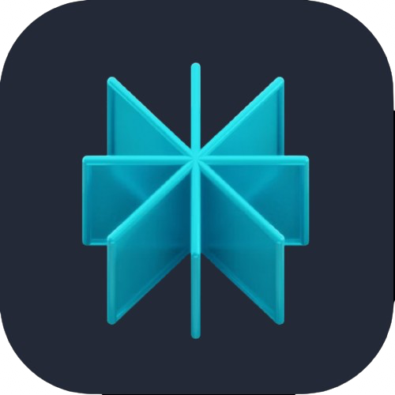

  
# 👋 We're CodeAstera

### A passionate IT Services brand from the heart of Raipur, India

	

- 🔭 We're currently working on [Code Astera](https://www.codeastera.com)
- 🌱 We're building the next-gen **services platform**
- 👯 We're looking to build projects for **passionate clients wanting to skyrocket their businesses**
- 👀 We're interested in **Web Development, Web Design, Blockchain, Cloud Services**
- 💬 Ask us about **everything tech**
- 📫 How to reach us: **hey@codeastera.com**
- ⚡ Fun fact: **We like space as much as we like tech**

### Connect with us:

  

### Languages and Tools:
<table>
	<tr>
		<td><strong>Programming Languages</strong></td>
		<td></td>
	</tr>
	<tr>
		<td><strong>Frontend Development</strong></td>
		<td></td>
	</tr>
	<tr>
		<td><strong>Backend Development</strong></td>
		<td></td>
	</tr>
	<tr>
	<tr>
		<td><strong>Database Technologies</strong></td>
		<td></td>
	</tr>
	<tr>
		<td><strong>Frameworks</strong></td>
		<td></td>
	</tr>
	<tr>
		<td><strong>Cloud Deployment</strong></td>
		<td></td>
	</tr>
	<tr>
		<td><strong>Hosting Services</strong></td>
		<td></td>
	</tr>
	<tr>
		<td><strong>Developer Tools</strong></td>
		<td> 
	</td>
	</tr>
	<tr>
		<td><strong>Debugging Tools</strong></td>
		<td>  &nbsp; &nbsp; &nbsp;    </td>
	</tr>
	<tr>
		<td><strong>Collaboration Platforms</strong></td>
		<td>  </td>
	</tr>
	<tr>
		<td><strong>Operating System</strong></td>
		<td>
		
		</td>
	</tr>
</table>

 
